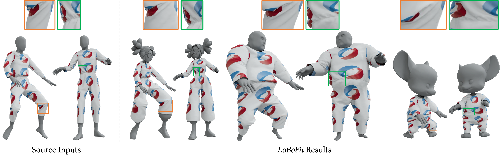

# LoBoFit: Flexible Garment Refitting via Local Bone Mapping Blending

## Introduction

This repository contains the implemetation of our SIGGRAPH 2026 paper, [LoBoFit: Flexible Garment Refitting via Local Bone Mapping Blending
](https://arxiv.org/abs/2605.07450).

  

Garment refitting, the task of adapting a garment from a source to a target avatar, must preserve the original design features and fine-scale wrinkles, a challenge exacerbated by significant shape variations and varying poses without registration to a shared canonical pose. Existing methods struggle to balance robustness, efficiency, and fidelity of detail: physics-based simulation is costly, data-driven approaches lack generalizability, and geometry optimization in the full vertex space is often ill-conditioned and prone to local minima with unsatisfactory quality. We identify that a fundamental limitation lies in the representation: deforming garments directly in global coordinates couples vertices non-locally, creating a complex and poorly-structured optimization landscape. Therefore, we introduce LoBoFit, a robust refitting method built upon a novel Local Bone Mapping Blending (LoBoMap Blending) representation. Instead of manipulating global vertex positions, LoBoMap Blending expresses garment geometry as a linear blend of its mappings into local bone coordinate frames. This representation is highly expressive and flexible: local bone mappings yield a pose-robust initialization and a well-conditioned parameterization, while blending weights smooth the optimization landscape and broaden the space of plausible solutions for stable convergence with fine-scale detail preservation. The subsequent refinement efficiently resolves collisions and preserves details by optimizing localized residuals, effectively decomposing the complex global deformation into manageable subproblems. Our experiments demonstrate that LoBoFit reliably refits high-resolution, single- and multi-layer garments across avatars with large shape and topological differences, while faithfully preserving intricate wrinkles and the intended fit style, outperforming state-of-the-art methods in robustness and output quality.

## Demo

[Watch the LoBoFit demo video](https://www.youtube.com/watch?v=5HFVixi_ODg)  

## Have fun!
We provide sample data for testing LoBoFit. Please download the data from [here](https://drive.google.com/drive/folders/1GywcZ3riuvvxMMseTDF2Ax1cRy3uD_sS?usp=sharing)

After downloading the data, you can try the coarse-to-fine garment refitting pipeline by running:

python Coarse_to_Fine_GarmRefitting.py

Before running the script, please modify the following parameters according to your data: `prefix`, `pose_name`, `dress_name`, `fit_mode`, `src_avatar`, and `tar_avatar`.

## License

This repository is released under the BSD 3-Clause "New" or "Revised" License.

## Patent Notice

Parts of this work may be covered by a pending Chinese patent application. This software release does not grant any express or implied licenses to any party's patent rights.
